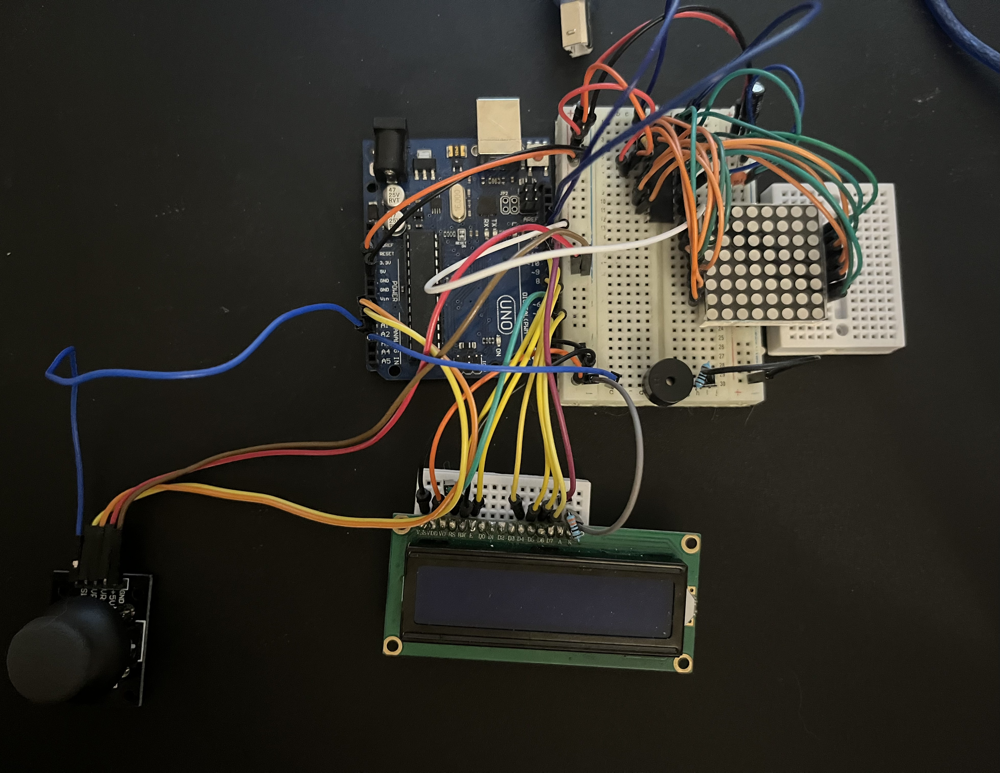

# ArduinoSnake
A game of Snake created using Arduino Uno


## Introduction
Simple yet addicting, Snake, in my opinion, is the best game to create on 8*8 matrix, for Arduino beginners and for those that already have substantial knowledge about hardware. 

## Game description
The player (you) controls a snake :snake: , which roams around, picking up food :apple: , trying to avoid hitting its own tail or other obstacles. Each time the snake eats a piece of food, its tail grows longer, making the game increasingly more difficult. Upon hitting something other then food, the snake loses a life. The game is over when the snake doesn't have any more lives to spare :skull: 

## How to play
Use joystick to move the snake around. Eat food and don't hit your own tail or other obstacles. You can select the difficulty from the menu, harder difficulty will get you higher score.

```
easy -> slow speed and no obstacles
medium -> slow speed, but with obstacles
hard -> high speed and no obstacles
insane -> high speed, but with obstacles
```

## Task requirements
### Menu requirements
* *Intro*: upon restarting the arduino, the animation will play with intro music
* *Main menu*
  * *Start*: start the game
  * *How to play*: short description on how to play the game
  * *Highscores*: see the highscores
  * *Settings*:
    * *Difficulty*: select the difficulty you want to play
    * *Sound*: turn the sound on/off
    * *Contrast*: modify contrast setting of LCD
    * *Brightness LCD*: modify LCD brightness setting
    * *Brightness Mat*: modify Matrix brightness
    * *Reset scores*: reset the highscores
  * *About*: see the information about the creator of the game
* *Sounds*: beeping while moving/clicking in menu
* *Custom characters*: every step in main manu/settings menu has it's own matrix image. LCD also includes several custom characters for animation, moving in menu and the game itself.
  
### Game requrements
* Sounds upon iteraction:
  * Snake moves
  * Snake eats
  * Snake turns
  * Snake hurts
* While in the game, LCD should desply the relevant information
  * Score: right up corner
  * Lives: left up corner 
* Difficulty progress: the game includes four difficulties (for more info see [how to play](#how-to-play))
  * Easy
  * Medium
  * Hard
  * Insane

## Components used
* Arduino Uno
* LED 8*8 Matrix
* MAX7219 matrix driver
* LCD display
* Joystick
* Passive buzzer
* Resistors and wires per logic


## Setup


## Functionality video
The video showcasing the functionality of the game can be found [here](https://youtu.be/SCtusyNwnbM)
